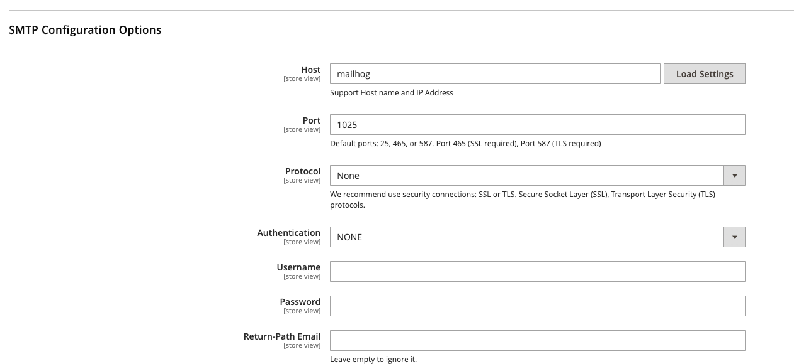
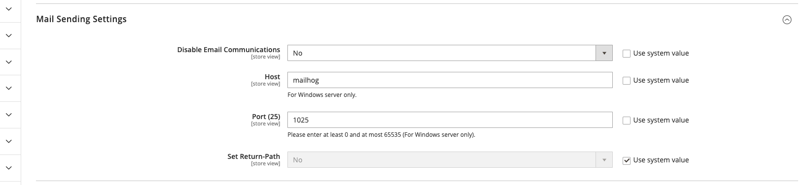

# Mailhog SMTP Configuration

For email testing you need mailhog to capture mails locally and not sending them. For this to work you need to point to 
the right SMTP server.

Use these settings to configure SMTP to point to [https://mailhog.roll.test/](https://mailhog.roll.test/)

Configuration SMTP:

| Key            | Value     |
|----------------|-----------|
| SMTP HOST      | `mailhog` |
| SMTP PORT      | `1025`    |
| AUTHENTICATION | NONE      |
| PROTOCOL       | NONE      |

## For Mageplaza SMTP module in Magento 2 

If you are using the Mageplaza SMTP module for magento 2 you can use the following configuration:

## Default Magento 2 SMTP configuration

Goto Menu -> Stores -> Configuration -> Advanced -> System -> Mail Sending Settings

